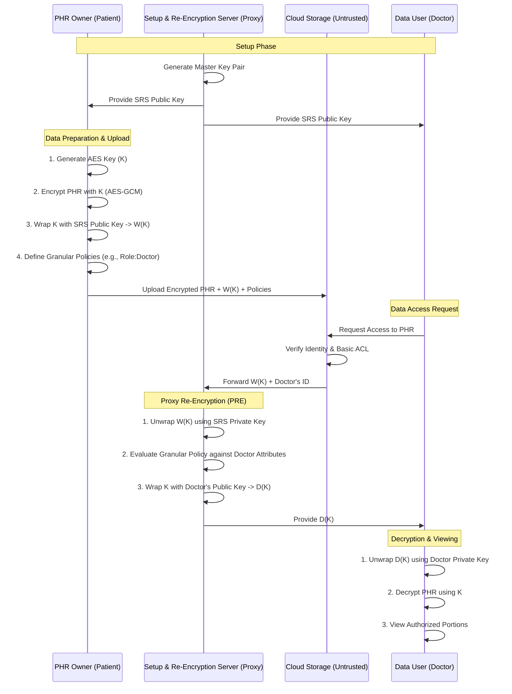

# SeSPHR System Architecture

The following diagram illustrates the secure methodology for sharing Personal Health Records (PHRs) in the cloud using Hybrid Encryption, Proxy Re-Encryption (PRE), and Granular Access Control.

## Key Components

1.  **Hybrid Encryption**: Combines symmetric encryption (AES-GCM) for data efficiency with asymmetric encryption (RSA-OAEP) for secure key transport.
2.  **Proxy Re-Encryption (SRS)**: A semi-trusted entity that transforms the patient's encrypted key into a doctor-specific encrypted key without ever storing the plaintext data.
3.  **Granular Access Control**: Enables the patient to define specific access policies for different sections of the health record (e.g., Lab Results vs. Personal Notes).
4.  **Attribute-Based Policy Evaluation**: Access decisions are made dynamically based on user attributes (Role, Department, etc.) rather than static user IDs.
