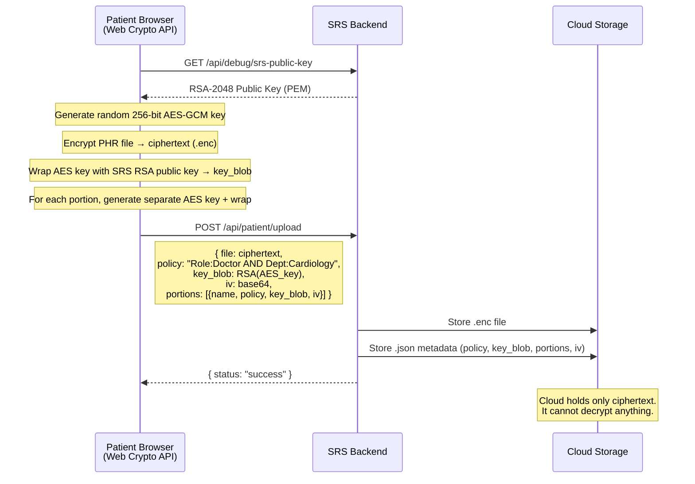
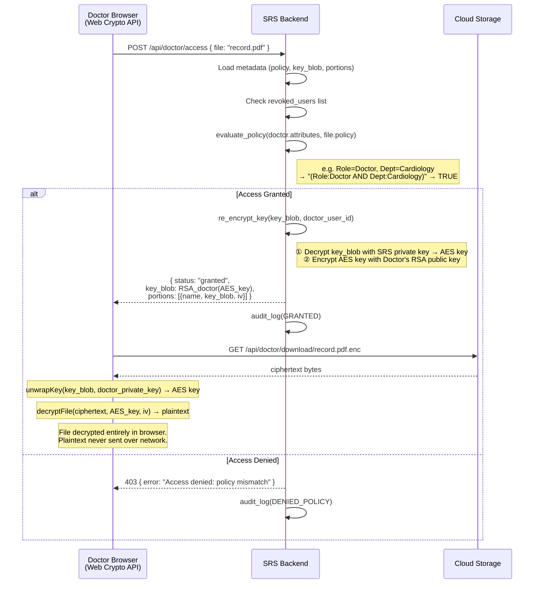
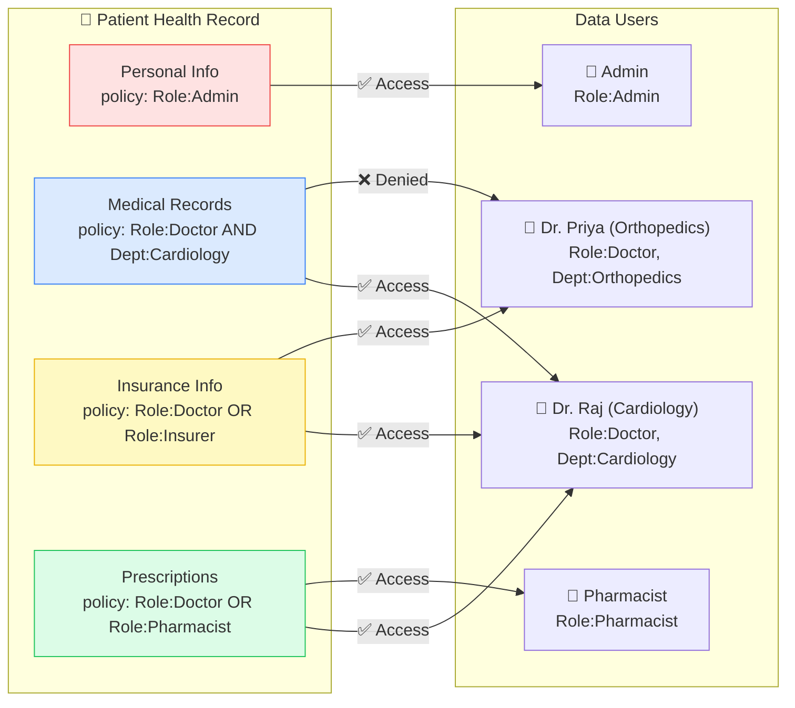
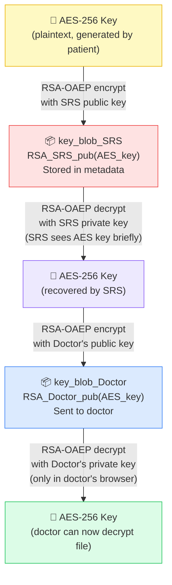
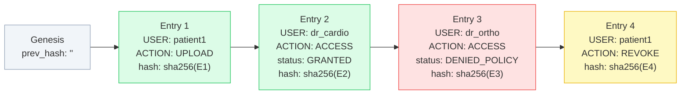
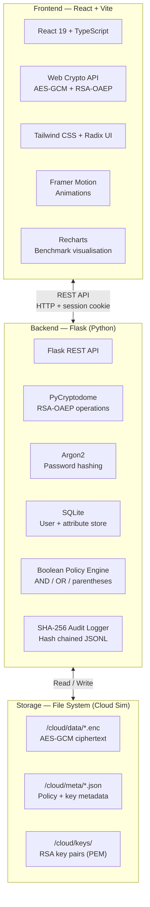

# SeSPHR — System Architecture

> **Based on:** *"SeSPHR: A Methodology for Secure Sharing of Personal Health Records in the Cloud"*
> Mazhar Ali, Assad Abbas, Muhammad Usman Shahid Khan, Samee U. Khan — IEEE

---

## 1. PHR Upload Flow (Patient Side)

The patient encrypts locally. The cloud never receives the key.



---

## 2. Access Request Flow (Doctor Side)

The SRS evaluates policy, re-encrypts the key, and the doctor decrypts in the browser.



---

## 3. PHR Portions — Granular Access Control

A single PHR is split into logical partitions. Each has its own policy and encryption key.



---

## 4. Proxy Re-encryption Key Transform

The SRS transforms the key without ever exposing the plaintext AES key to the cloud or any unauthorised party.



---

## 5. Audit Log — Tamper-Evident Hash Chain

Every access event is chained with SHA-256. Any tampering breaks the chain and is detected instantly.



---

## 6. Technology Stack



---

## 7. Project Directory Map

```
sesphr/
├── backend/
│   ├── app/
│   │   ├── api/
│   │   │   ├── auth.py          # Login, signup, session
│   │   │   ├── patient.py       # Upload, revoke, grant
│   │   │   ├── doctor.py        # Access request, download
│   │   │   └── admin.py         # Users, audit, benchmark
│   │   └── services/
│   │       ├── crypto/
│   │       │   ├── keys.py      # RSA key generation (SRS + users)
│   │       │   └── ops.py       # Proxy re-encryption (SRS core)
│   │       ├── policy/
│   │       │   └── parser.py    # Boolean attribute policy engine
│   │       ├── audit/
│   │       │   └── logger.py    # SHA-256 hash-chained audit log
│   │       └── storage/
│   │           ├── users.py     # SQLite user + attribute CRUD
│   │           └── phr.py       # Encrypted PHR file store
│   ├── seed_demo_users.py       # Creates demo accounts
│   └── tests/
│       └── benchmark_suite.py   # Performance benchmarks
│
├── frontend/
│   └── src/
│       ├── pages/
│       │   ├── patient/         # Upload, manage, revoke
│       │   ├── doctor/          # Request access, view, download
│       │   └── admin/           # Users, audit, benchmark charts
│       └── utils/
│           ├── crypto.ts        # Web Crypto API wrappers
│           └── policy.ts        # Client-side policy preview
│
├── cloud/                       # Simulated cloud storage
│   ├── data/                    # .enc files
│   ├── meta/                    # .json metadata
│   └── keys/                    # RSA key pairs
│
├── docs/
│   ├── architecture.md          # This file
│   └── demo-guide.md            # Step-by-step demo script
│
└── Paper/
    └── SeSPHR_*.pdf             # Reference paper
```
